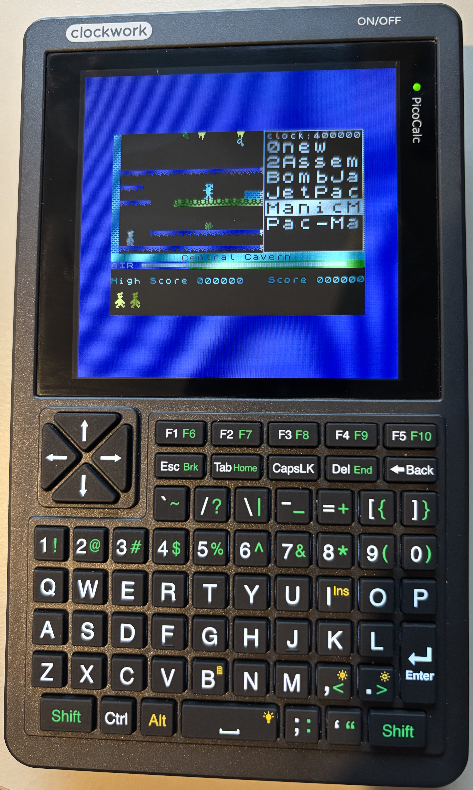

# zx-picocalc: A ZX Spectrum Emulator for the PicoCalc
**Note:** This is a fork of the original **[zx2040 by Salvatore Sanfilippo](https://github.com/antirez/zx2040)**, which itself is a port of [Andre Weissflog's](https://github.com/floooh/chips/) emulator.
This version has been specifically adapted to run on the PicoCalc hardware. All credit for the powerful core emulator goes to the original authors.

**Video demo** [here](https://www.youtube.com/shorts/tdEk7oRfxbU).

* 

**`zx-picocalc`** is a port of the zx2040 ZX Spectrum 48k emulator, modified to run correctly on the [PicoCalc](https://www.clockworkpi.com/picocalc) handheld.

It features a simple UI for game selection, emulates the Kempston joystick and makes use of a full PicoCalc keyboard, allowing not only for playing classic ZX Spectrum games but also programming in 48 BASIC.

## Main features

* **UI that allows to select games** into a list, change certain emulation settings and so forth.
* **Easy games upload**, with a script to create a binary image of Z80 games and transfer it into the Pico flash.
* **Full Spectrum keyboard support**, with all Caps Shift, Symbol Shift and Extended Mode combinations working. PicoCalc-specific keys, e.g. F1-F10, Tab, Back had been mapped to ZX keys for more comfortable operation.
* **Kempston Joystick** emulated in two ways: with **arrow keys + `F5`** for fire and with an output for an **actual joystick**, connected to the input on left side of PicoCalc.
* **Real time upscaling and downscaling** of video, to use the emulator with displays that are larger or smaller than the Spectrum video output. The emulator is also able to remove borders.
* **Tufty -> Spectrum key mapping** had been disabled. PicoCalc does offer a full keyboard so it was not a priority while made debugging much easier.
* **Crazy overclocking** to make it work fast enough on RPi 2040 :D

## Installation 
1. **Download:** Go to the [Releases](https://github.com/ohm69/zx-picocalc/releases) page and download the latest `zx-picocalc.uf2` file.
2. **Bootloader Mode:** Connect your PicoCalc with a computer with a micro USB port (not USB-C) while holding the `BOOTSEL` button. On a PicoCalc this button is available on the back, through the vents, marked with tiny `reset` text. The device will appear on your computer as a USB drive named `RPI-RP2`.
3. **Flash:** Drag and drop the downloaded `.uf2` file onto the `RPI-RP2` drive. The device will reboot automatically.

## Adding Games / ZX software
1. Connect your PicoCalc, again in bootloader mode (micro USB while holding the `BOOTSEL` button).
2. Enter the `games` directory in this repository.
3. Copy your .Z80 game files into the games/Z80 subdirectory.
4. Run the `./loadgames.py` script. This will bundle the games and keymaps and upload them to the Picocalc's flash. This script requires Python installed on your machine.
5. Disconnect USB cable

## Controls

### Emulator UI

The UI of `zx picocalc` is a simple menu, displayed in the top right corner. It allows for loading software and changing some runtime emulator parameters.
* `Esc`: Enter / Exit the menu. 
	* Note: exiting the menu that way will leave an artifact (black rectangle) on the screen. This has to be that way in order to preserve limited RAM of RPi2040.
* `Up`/`Down`: Select a game or a parameter
* `Left`/`Right`: Change parameter value
* `Enter` or `F5`/`Fire`: Load the game and exit the menu. Pressed on a current game reloads it.

### Emulated ZX controls

* `Up`/`Down`/`Left`/`Right`/`F5` on a PicoCalc keyboard: Kempston joystick emulation. Remember to first select Kempston Joystick option in a game.
* `F1`: `Edit` (Shift-1 on ZX Spectrum)
* `F2, Tab`: `Extend Mode` (Shift-Symbol Shift on ZX Spectrum)
* `F3`: `Cursor Left` (Shift-5 on ZX Spectrum)
* `F4`: `Cursor Right` (Shift-8 on ZX Spectrum)
* `F6`: `Graphics` (Shift-9 on ZX Spectrum)
* `F7`: `Caps Lock` (Shift-2 on ZX Spectrum). This is separate from CapsLK on PicoCalc keyboard!
* `F8`: `True Video` (Shift-3 on ZX Spectrum)
* `F9`: `Inv Video` (Shift-4 on ZX Spectrum)
* `Del, Back`: `Delete` (Shift-0 on ZX Spectrum)
* `Shift-Up`/`Shift-Down`: `Cursor Up/Down` (Shift-6/7 on ZX Spectrum)
* `0-9 and QWERTY keys`: regular ZX Spectrum keys with keywords, letters, symbols available as on ZX Spectrum
* `Shift`(the green one): `Picocalc Shift`- lowecase letters and symbols marked green on the PicoCalc
* `Ctrl`: `ZX Shift`- lowercase letters and symbols marked **white** over numeric keys **on a ZX Spectrum keyboard**
* `Alt`: `Symbol Shift`- symbols and keywords marked **red** on a ZX Spectrum keyboard

## Credits
I want to thank [Salvatore Sanfilippo](http://invece.org/) for writing [zx2040](https://github.com/antirez/zx2040) in a way that even I 😉 could easily understand. 
And to [Andre Weissflog](https://floooh.github.io/) for writing the [original code](https://github.com/floooh/chips).

## Installation from sources

If you build from sources:
* Install `picotool` (`pip install picotool`, or alike) and the Pico SDK.
* Try building one of the example projects included in Pico SDK first. If you cannot build `hello_usb` then you won't be able to build `zx-picocalc`. Ask me how I know.
* Create a `device_config.h` file in the main directory. For the PicoCalc just do `cp devices/picocalc.h device_config.h`.
* Compile with: `mkdir build; cd build; cmake ..; make`.
* Transfer the resulting `zx.uf2` file to your Pico (put it in boot mode pressing the boot button as you power up the device, then drag the file in the `RPI-RP2` drive you see as a USB drive).

## Using this emulator for commercial purposes

All the code here MIT licensed, so you are free to use this emulator for commercial purposes. Feel free to sell it, put it as example in your boards or whatever you want to do with it. **However please note that games you find in the wild are often copyrighted material** and are not under a free license. Either use free software games with a suitable license (there are new games developed for the Spectrum every year, very cool ones too: pick the ones with a suitable license), or ask permission to the copyright owners. In any case, **you will be responsible for your actions, not me :)**.

About the ZX Spectrum ROM included in this repository, this is copyrighted material, and the current owner is the Sky Group, so if you want to do a commercial product using this code using also the ROM, you need to contact Sky Group. This is what happened so far:
* The original owner was Sinclair, that was sold to Amstrad.
* Amstrad agreed that having the ROMs as parts of NON commercial use was fair use. That's really cool, and one of the reasons why Spectrum emulators are legal.
* Then Amstrad was sold to the Sky Group. Apparently the ZX Spectrum Next has official permission from the Sky Group to use the ROM. So the position of the Sky Group is yet very open.
* However if you want to make anything commercial with the ROM, you need an official written permission. If you want to use this emulator without the ROM, to run a snapshot image that does not use any code inside the ROM, you can just discard the ROM file, and use this emulator for any purpose.
